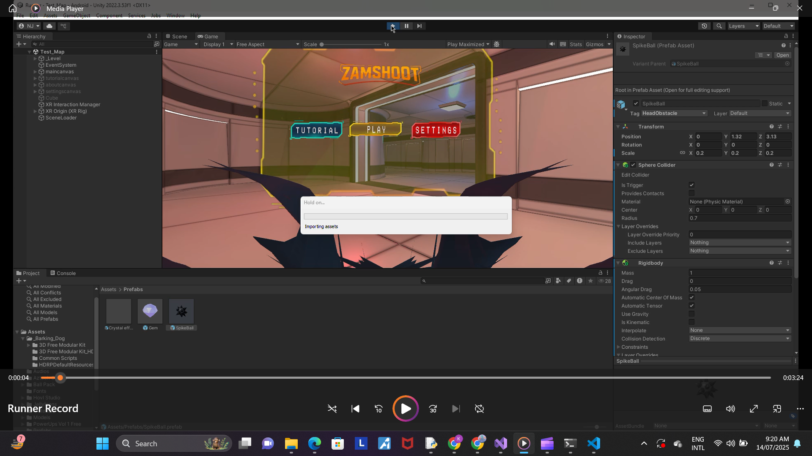
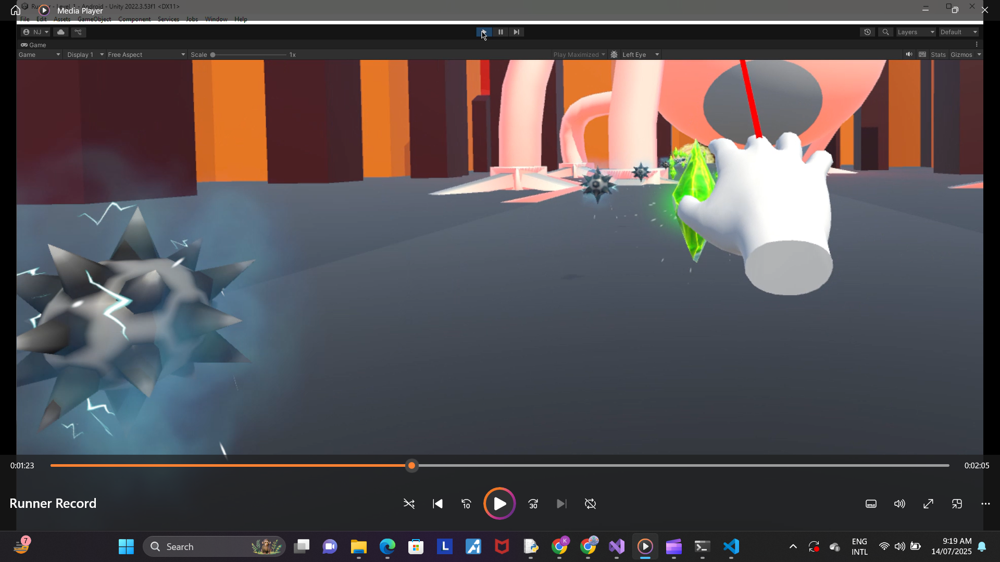
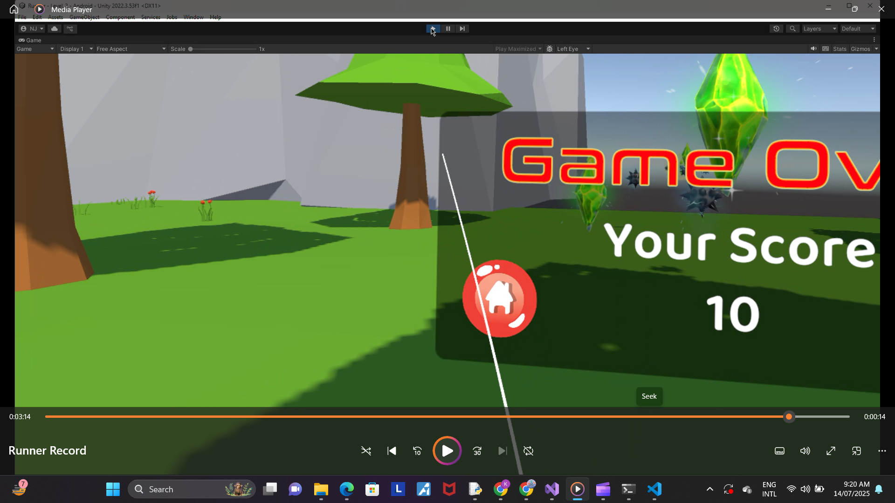

# ZamShoot-VR 🎮🕶️

**ZamShoot-VR** is an immersive **lane-based VR fitness runner game** that blends physical movement with exciting gameplay. Players dodge obstacles, collect gems, and switch lanes in a futuristic VR world — built using Unity and OpenXR.

---

## 🚀 Gameplay Overview

- Switch lanes to dodge **spikes**
- Perform **squats** to escape deadly traps
- **Jump or stretch** to grab gems
- Reach the **portal** to transition into a new environment

---

## 🎯 Target Audience

- Designed for ages **12–16**
- Promotes **fitness through fun** and **VR immersion**
- Ideal for school VR labs, exhibitions, or indie game events

---

## 🧠 Core Features

- 🧍 Full-body interaction (lane switch, squats, jumps)
- 🔄 Randomized gem & spike spawning
- 🧠 Score system (10 points per gem)
- ❌ Game over on spike contact
- 🔮 Portal system for environment transitions

---

## 📽️ Demo Videos

> Videos are located in the `screenrec` folder. You can download and watch them locally.

- ▶️ [part1.mp4](screenrec/part1.mp4)
- ▶️ [part2.mp4](screenrec/part2.mp4)
- ▶️ [part3.mp4](screenrec/part3.mp4)

---

## 📸 Screenshots

| Start Menu | In-Game | End Screen |
|------------|---------|------------|
|  |  |  |

---

## 🛠️ Built With

- 🎮 **Unity** (3D URP Template)
- 🧪 **OpenXR** SDK
- 🏝️ 3D environments from Unity Asset Store

---

## 📁 Folder Structure

```

Zamshoot-VR/
│
├── Assets/
├── Scenes/
├── Scripts/
├── screenrec/         # Demo videos and screenshots
│   ├── part1.mp4
│   ├── part2.mp4
│   ├── part3.mp4
│   ├── image0.png
│   ├── image1.png
│   └── image2.png
└── README.md

```

---

## 👤 Developer

**Karishma Sankar**  
🎓 Final Year VR Project – *ZamShoot-VR*  
🔗 GitHub: [@karishmasankar](https://github.com/karishmasankar)
```

---

